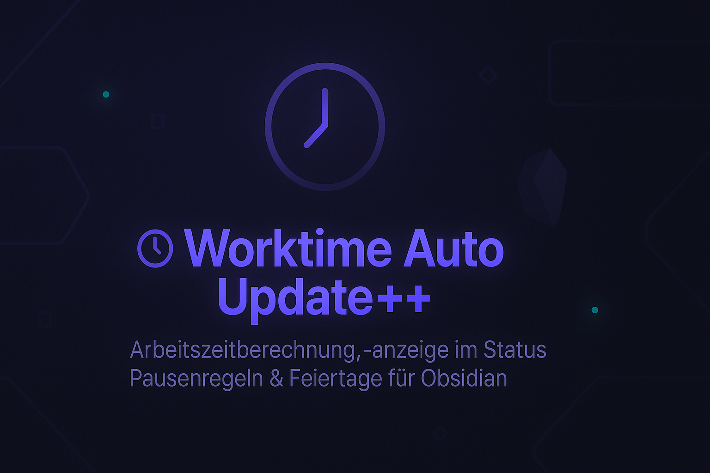

<p align="center">
  
</p>

---

## ✨ Neue Features & Fixes in 1.2.9

✅ **Kein Scrollsprung mehr** im Einstellungsfenster  
✅ **Feiertage speichern korrekt** im konfigurierten Pfad (`meta/holidays.json`)  
✅ **Custom-Feiertage** werden sofort in der Oberfläche sichtbar  
✅ **Bundesland-Auswahl** für Feiertage (inkl. Himmelfahrt, Fronleichnam usw.)  
✅ **Pausenregeln konfigurierbar** mit flexiblen Stunden-Minuten-Werten  
✅ **Feiertage pro Jahr generierbar**  
✅ **Live-Arbeitszeit in Statusleiste**

---

✨ Überblick

Worktime Auto Update++ ist ein intelligentes Obsidian-Plugin, das deine tägliche Arbeitszeit automatisch verwaltet und dir dabei hilft, Balance und Übersicht zu behalten.

Es kombiniert automatische Arbeitszeitberechnung, individuelle Pausenlogik, Feiertagsverwaltung (nach Bundesland) und eine visuelle Live-Statusleiste – alles vollständig offline und konfigurierbar.

Ob du im Büro, im Homeoffice oder am Wochenende arbeitest – dieses Plugin erkennt automatisch deine Arbeitszeiten und berücksichtigt deine Pausen- und Feiertagsregeln.

⚙️ Hauptfunktionen
Kategorie	Beschreibung
🕒 Arbeitszeiterfassung	Berechnet Arbeitszeit automatisch auf Basis von Start- und Endzeit im Frontmatter.
⏸️ Pausenregeln	Definiere mehrere Pausenregeln, z. B. ab 6 h → 30 min, ab 9 h → 45 min usw.
📅 Feiertagsverwaltung	Feiertage pro Bundesland generierbar, inklusive Heiligabend & Silvester.
🗓️ Eigene freie Tage	Ergänze manuell beliebige freie Tage mit Datum und Beschreibung.
💬 Live-Statusleiste	Zeigt aktive Arbeitszeit in Echtzeit unten in der Statusbar.
🧭 Konfigurationsfenster	Intuitives GUI mit übersichtlicher Darstellung und direkter Bearbeitung.
💾 Offline & Portabel	Keine Cloud- oder API-Abhängigkeiten – alle Daten lokal in meta/holidays.json.
💡 Beispiel: Pausenregeln

Definiere deine Regeln direkt in der Plugin-Konfiguration:

Arbeitszeit (Stunden) -	Pause (Minuten)
6 -	30
9 -	45
10 - 60

Das Plugin erkennt automatisch, welche Regel gilt – und zieht sie bei der Berechnung ab.

📁 Beispiel: meta/holidays.json
{
  "2025": {
    "2025-01-01": "Neujahr",
    "2025-05-01": "Tag der Arbeit",
    "2025-10-03": "Tag der Deutschen Einheit",
    "2025-12-25": "1. Weihnachtstag",
    "2025-12-26": "2. Weihnachtstag",
    "2025-12-24": "Heiligabend",
    "2025-12-31": "Silvester"
  },
  "custom": {
    "2025-08-15": "Familientag",
    "2025-12-27": "Brückentag"
  }
}

🔧 Technische Details
Merkmal	Wert
🧩 Plugin-ID	worktime-auto-update-plusplus
🖥️ Plattform	Desktop (Windows, macOS, Linux)
💾 Speicherort	.obsidian/plugins/worktime-auto-update-plusplus
💬 Sprache	Deutsch / Englisch
🧠 Mindestversion	Obsidian 1.4.0
🛠️ Technologie	Obsidian API, JavaScript, JSON, CSS
📄 Lizenz	MIT

---

## ⚙️ Installation

### 🧩 Manuelle Installation

1. Lade die Datei **`worktime-auto-update-plusplus_v1.2.9.zip`** herunter.  
2. Entpacke sie in deinen Vault unter:

<Vault>/.obsidian/plugins/worktime-auto-update-plusplus/

yaml
Code kopieren
3. Starte Obsidian neu.
4. Aktiviere das Plugin in  
**Einstellungen → Community Plugins → Worktime Auto Update++**

---

### 🪄 Update von älteren Versionen

1. Deaktiviere das Plugin.  
2. Ersetze die alte Plugin-Version durch die neue.  
3. Aktiviere das Plugin erneut.

---

## ⚙️ Konfiguration

### 🗂 Pfad zu Feiertagen
Wähle, wo deine Feiertage gespeichert werden sollen (z. B. `meta/holidays.json`).

Die Datei wird automatisch erstellt und gepflegt.

---

### 🏠 Bundesland
Wähle dein Bundesland, um automatisch alle Feiertage des aktuellen Jahres zu generieren.

---

### 🎈 Eigene freie Tage
Trage beliebige Zusatz-Feiertage ein:
- Datum: `YYYY-MM-DD`
- Name: Freie Bezeichnung

---

### 🕒 Pausenregeln
Beispiele:
| Arbeitszeit (h) | Pause (min) |
|------------------|-------------|
| 6                | 30          |
| 9                | 45          |
| 10               | 60          |

Neue Regeln hinzufügen oder löschen per Klick.

---

## 📁 Beispiel `meta/holidays.json`

```json
{
"2025": {
 "2025-01-01": "Neujahr",
 "2025-05-01": "Tag der Arbeit",
 "2025-10-03": "Tag der Deutschen Einheit",
 "2025-12-25": "1. Weihnachtstag",
 "2025-12-26": "2. Weihnachtstag"
},
"custom": {
 "2025-12-24": "Heiligabend",
 "2025-12-31": "Silvester"
}
}
```

💡 Hinweise
Komplett offlinefähig
- Keine externen API-Aufrufe
- Kompatibel mit Obsidian ≥ 1.4.0

